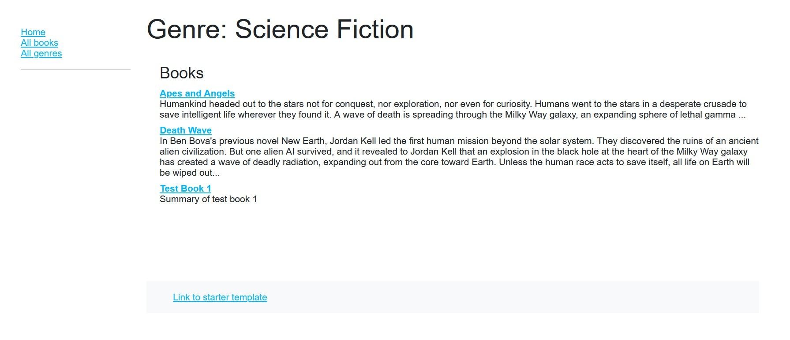
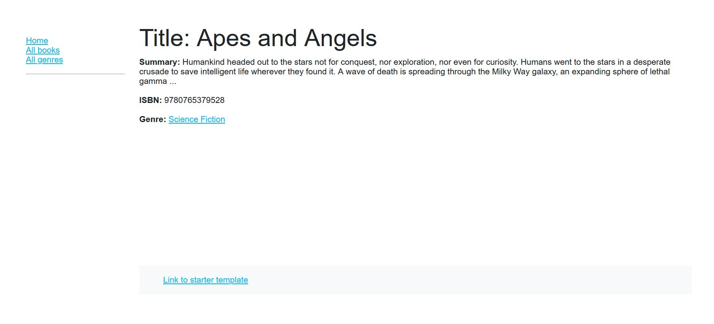

<p align="center">
    
    <h2 align="center">Express Typescript Started</h2>
</p> 
<p align="center">
   
  </p>
<p align="center">A starter template for express (typescript) so I don't need to create boilerplate code for every project :D</b></p>

## Desc 📙
A simple library application that can show books detail and genre.

The main purpose of this repository is to show a small working Express.js API application + simple frontend (sorry this is not the main focus :D). 
This is the example repository from the MDN tutorial about express js [click here](https://developer.mozilla.org/en-US/docs/Learn/Server-side/Express_Nodejs/Tutorial_local_library_website). I personally use this as a way to explore the framework.

## Sneakpeak

<table>
  <tr>
    <td valign="top">
        
    </td>
    <td valign="top">
        
    </td>
  </tr>
</table>


## Featuring...
The following application template follows Uncle Bob [Clean Architecture](https://8thlight.com/blog/uncle-bob/2012/08/13/the-clean-architecture.html) principles and project structure.


Please read the post in order to have a good understanding of the server architecture and expressjs.

This clean architecture is based on my intepretation and my skill (cause I'm still new in Javascript world 😅😅) and only will be used as my own documentation and project template

The API by itself doesn't do anything fancy, it's just a book library CRUD API with some Views to show data. (similar to how the tutorial shows in the post)

## Getting Started
- Clone the repository
```bash
git clone --depth=1 https://github.com/William9923/Express-Typescript-Starter <project_name>
```
- Install dependencies
```bash
cd <project_name>
npm install
```
- Done! (notes : It still using the Mock Database, need furthur configuration for using Mongoose or Sequelize)

## Project Anatomy
```
boiler-plate
├───src
│   ├───config
│   ├───controllers
│   │   └───api
│   ├───daos
│   │   ├───Book
│   │   ├───Genre
│   │   └───mock
│   ├───errors
│   ├───middlewares
│   ├───models
│   ├───public
│   │   ├───css
│   │   ├───fonts
│   │   ├───img
│   │   ├───js
│   │   └───scripts
│   ├───routes
│   │   └───api
│   ├───shared
│   └───validations
├───tests
└───views
    ├───book
    ├───genre
    └───partials
```

## Application Layer
This Project focus on 3 layers:
- Domain Layer (models)
- Usecase / service layer (notes : implemented in controller, in complex solution need to be created seperately)
- Controller Layer
- Framework / infrastructure layer (daos & views)

## Middleware
Can create custom middleware using this template
Example of custom middleware
- logging middleware : `src\middlewares\logging.ts`

## Config
Config could be seen as a place to put the env variables needed by the application. Also make your env variable available for intellisense in VSCode.

## Utility
Utility / Shared function for the whole project and can be used for many usecase.

## Scripts
Scripts directory is placed in `src/public/scripts`. This project give 2 example of scripts :
- `populate_mongo.js` : Populate db using mongo db
- `populate_postgres.js` : Populate db for postgresql

## Tests
Should be used to store unitest for app service. This project used Jest & Mocha for testing, feel free to change based on your preference.

## Scripts
This boilerplate comes with a collection of npm scripts to make your life easier, you'll run them with npm run <script-name> :
- `seed` : to seed database (using mongo or postgres sql)
- `dev` : to run in development environment 
- `start` : to run the application in prod env

ps: All script available in package.json

## The Dependency Rule
> The overriding rule  usually more useful for static-typed language, as we can use interface to make each layer seperate from each other. For dynamic-typed languange such as Javascript or Python, it will need more adjustment but it will be worth it for bigger project (as the change from each layer will not affect others code parts)...

## Special Thanks 
This project cannot be created without the help from these repo:
- [Express Guide MDN](https://developer.mozilla.org/en-US/docs/Learn/Server-side/Express_Nodejs/Tutorial_local_library_website)
- [Microsoft Typescript Template](https://basarat.gitbook.io/typescript/)
- [Typescript Book Guide](https://basarat.gitbook.io/typescript/)
- [Clean Architecture](https://blog.cleancoder.com/uncle-bob/2012/08/13/the-clean-architecture.html)


## ❤️ Support
If you feel that this repo have helped you provide more example on learning software engineering, then it is enough for me! Wanna contribute more? Please ⭐ this repo so other can see it too!
